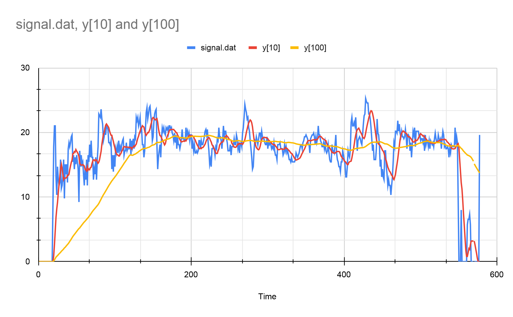

# Discrete-Time Moving Average Filter Project

This project implements a discrete-time moving average filter, a simple Finite Impulse Response (FIR) filter used in signal processing.



## Overview

The C program provided reads data from the `signal.dat` file and computes two filtered output signals, `y10` and `y100`, for filter orders 10 and 100, respectively. These signals are derived using a moving average filter applied to the input signal `x[n]`.

## Program Implementation

### Running the Program

1. **Download the Data File**: Ensure the `signal.dat` file is available in the specified path or update the file path in the code if needed.
2. **Compile the Program**: Use a C compiler (e.g., GCC) to compile the program.
    ```bash
    gcc -o FIRFilter FIRFilter.c
    ```
3. **Execute the Program**: Run the compiled program.
    ```bash
    ./FIRFilter
    ```

## Filtering Process

The program computes the filtered output signals `y10` and `y100` based on the moving average filter principle. It reads data from the file and performs the following steps:

1. **File Reading**: Reads data from `signal.dat` into an array `x[n]`.
2. **Filtering Procedure**:
    - **y10 Calculation**: Computes `y10` by averaging the previous 10 samples of `x[n]`.
    - **y100 Calculation**: Computes `y100` by averaging the previous 100 samples of `x[n]`.
3. **Output Display**: The program prints the computed `y100` values for demonstration purposes.

## Note

- Ensure the data file (`signal.dat`) is in the correct path or modify the file path in the code accordingly.
- Adjustments to the filtering logic or further visualization using plotting applications can enhance the project.

Feel free to modify the program or add more details as needed for your project's documentation.
